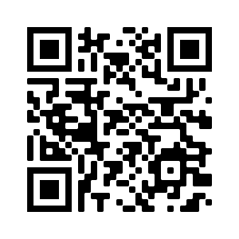

## You will make

Create a piece of encoded art based on the user's name. Each letter is encoded to a shape that is displayed at random on the screen.

In this project you will:
+ Use a dictionary to encode letters with a variety of shapes
+ Use functions with parameters to add customisation to shapes
+ Create a unique piece of digital art using encoded letters

Encoding is when you convert data from one form to another. **QR codes** are like a little piece of **encoded** art. They are used to represent data, such as website addresses or text. They are made up of black and white squares that are used to represent letters or numbers. The black and white patterns can be read and decoded by computers.

{:width="200px"}

### Get ideas 💭

You are going to make some design decisions about the kind of artwork that will be produced when the user enters their name. 

--- task ---

Look at these examples. Think about your background and think about whether your design will include shapes, patterns, images, or a combination. 

**Circles, squares, and triangles:** [See inside](https://editor.raspberrypi.org/en/projects/circles-squares-triangles){:target="_blank"}

<iframe src="https://editor.raspberrypi.org/en/embed/viewer/circles-squares-triangles" width="600" height="600" frameborder="0" marginwidth="0" marginheight="0" allowfullscreen>
</iframe>

**Lost in space:** [See inside](https://editor.raspberrypi.org/en/projects/lost-in-space){:target="_blank"}

<iframe src="https://editor.raspberrypi.org/en/embed/viewer/lost-in-space" width="600" height="600" frameborder="0" marginwidth="0" marginheight="0" allowfullscreen>
</iframe>

**All the fruit!:** [See inside](https://editor.raspberrypi.org/en/projects/all-the-fruit){:target="_blank"}

<iframe src="https://editor.raspberrypi.org/en/embed/viewer/all-the-fruit" width="600" height="600" frameborder="0" marginwidth="0" marginheight="0" allowfullscreen>
</iframe>

**Geometric patterns:** [See inside](https://editor.raspberrypi.org/en/projects/geometric-patterns-example){:target="_blank"}

<iframe src="https://editor.raspberrypi.org/en/embed/viewer/geometric-patterns-example" width="600" height="600" frameborder="0" marginwidth="0" marginheight="0" allowfullscreen>
</iframe>

--- /task ---

