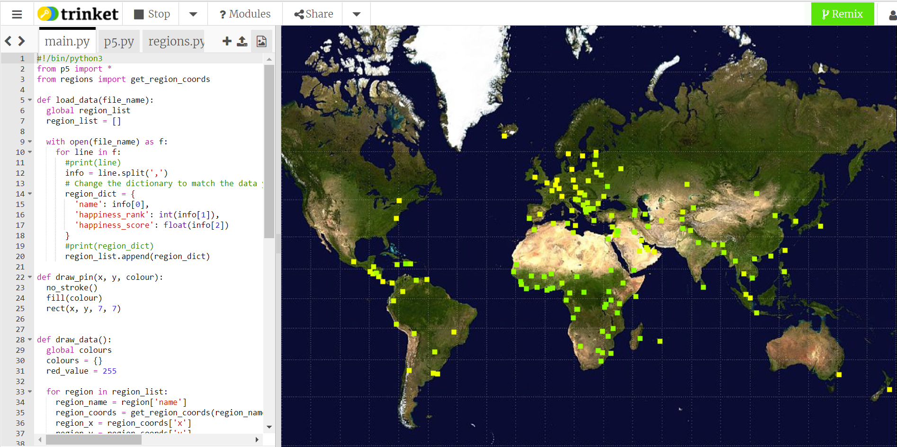

## What next?

If you are following the [More Python](https://projects.raspberrypi.org/en/raspberrypi/python-2) path, you can move on to the [Mapping data](https://projects.raspberrypi.org/en/projects/mapping-data) project. In this project, you will make a map that plots different data points from around the world.

--- print-only ---

--- /print-only ---

--- no-print ---

<iframe src="https://trinket.io/embed/python/b70e25c42a?outputOnly=true&runOption=run" width="100%" height="600" frameborder="0" marginwidth="0" marginheight="0" allowfullscreen></iframe>

--- /no-print ---

If you want to have more fun exploring Python, then you could try out any of [these projects](https://projects.raspberrypi.org/en/projects?software%5B%5D=python&curriculum%5B%5D=%202).
