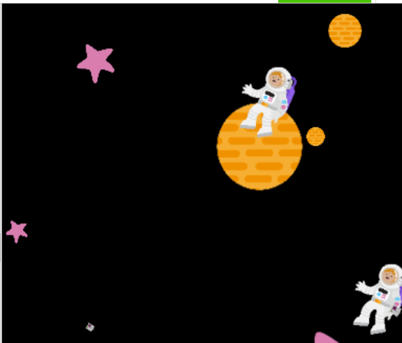

## Place your shapes

Now that you have repeatable shapes for your artwork, you need to place them on the canvas.

{:width="300px"}

--- task ---

**Choose:** How will you place your shapes on the canvas? Will it be randomly, or will they have a specific pattern?

--- /task ---

--- task ---

**Decide** where you want your shapes to appear in the window. They could appear:

+ Randomly around the window
+ In sequence from left to right
+ In the same place every time
+ To another set pattern 

--- collapse ---
---
title: Placing shapes randomly 
---

From the `random` library, import `randint` and `seed` at the top of your script.

**Add** a call to `seed()` in your `draw()` function below `draw_background()`. You will need to enter an argument for the seed, which can be any number:

--- code ---
---
language: python
filename: main.py
line_numbers: false
line_number_start: 
line_highlights: 
---
draw_background(red)
seed(32)

--- /code ---

Change your shape functions to set random coordinates for each shape when drawing:

--- code ---
---
language: python
filename: main.py
line_numbers: true
line_number_start: 6 
line_highlights: 
---
def shape_1(colour, size):
  
  fill(colour)   
  ellipse(200, 200, size, size)
--- /code ---

Becomes:

--- code ---
---
language: python
filename: main.py
line_numbers: true
line_number_start: 6
line_highlights: 8-9, 11
---
def shape_1(colour, size):
  
  x = randint(0, 400)
  y = randint(0, 400)
  fill(colour)   
  ellipse(x, y, size, size)
--- /code ---

--- /collapse ---

--- collapse ---
---
title: Shapes which require declared points
---
Some shapes in the `p5` library require all their corners to be declared, specifically `triangles` and `quads`. To randomise their position, you have to do some quick maths. 

For example:

--- code ---
---
language: python
filename: main.py
line_numbers: false
line_number_start: 
line_highlights: 
---
triangle(200, 200, 250, 100, 300, 200)

--- /code ---

Becomes:

--- code ---
---
language: python
filename: main.py
line_numbers: false
line_number_start: 
line_highlights: 
---
triangle(x, y, x+50, y-100, x+100, y)

--- /code ---

--- /collapse ---

--- collapse ---
---
title: Creating a specific pattern like *African Inspired Art*
---

If you take a look at **African inspired art:**, you will notice that it places the shapes across the page and then down, like text:

[See inside](https://trinket.io/python/6067bf289c){:target="_blank"}

<iframe src="https://trinket.io/embed/python/6067bf289c?outputOnly=true&runOption=run" width="600" height="600" frameborder="0" marginwidth="0" marginheight="0" allowfullscreen></iframe>

This can be achieved by creating global variables in your draw loop called `startx` and `starty`, then setting them both to `0`:

--- code ---
---
language: python
filename: main.py - draw()
line_numbers: false
line_number_start: 
line_highlights: 
---
global startx, starty
startx = 0
starty = 0

--- /code ---

These variables will be used to iterate the `x` and `y` values for each shape in the main menu function you will write later. Inside each of your shape functions, change the `x` and `y` values to use these global variables.

--- code ---
---
language: python
filename: main.py
line_numbers: false
line_number_start: 
line_highlights: 
---
def shape_2(colour, size):

  x = randint(0, 400)
  y = randint(0, 400)
  fill(colour)   
  rect(x, y, size, size)
--- /code ---

Becomes:

--- code ---
---
language: python
filename: main.py
line_numbers: false
line_number_start: 
line_highlights: 
---
def shape_2(colour, size): 

  global startx
  global starty
  x = startx
  y = starty
  fill(colour)   
  rect(x, y, size, size)
--- /code ---

Because you need to detect whether the shapes will go 'off the side' of the canvas, create a function to check the initial `x` coordinate of the next shape is less than your window size and set it back to 0 if it is, while also moving it down the window by increasing the initial `y` coordinate of the shape. 

**Define** a new function called `size_check()` now:

--- code ---
---
language: python
filename: main.py
line_numbers: false
line_number_start: 
line_highlights: 
---
def size_check():

  global startx
  global starty
  if startx >= 400:
    startx = 0
    starty +=80

--- /code ---

**Tip:** Look for more instructions on calling this function when coding the input loop, during the **Encode a message** step!

--- /collapse ---

--- /task ---

--- task ---

**Test** your code to see if it displays your chosen images on the screen. At this point they should all appear spread around the window. **Experiment** with the `seed()` value to see the pattern change. 

--- /task ---

--- task ---

**Debug:**

--- collapse ---
---
title: I'm getting an error about `randint` or `seed`
---
Make sure you have imported `randint` and `seed` from the `random` library at the top of your script: `from random import randint, seed`

--- /collapse ---

--- collapse ---
---
title: The pattern isn't different from last time
---
Make sure your shape functions contain the lines `x = randint(0,400)` and `y = randint(0,400)` and the shape parameters are set to `x` and `y`, not numbers: `rect(x, y, size, size)`

--- /collapse ---

--- collapse ---
---
title: My shapes are moving around really fast
---
Make sure you have included a call to `seed()` in your `draw()` function, which includes a number as an argument: `seed(72)`

--- /collapse ---

--- /task ---

--- save ---