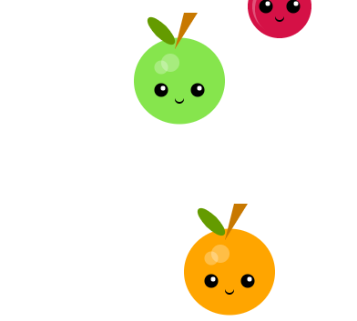

## Build your dictionary

Create the dictionary that will encode each letter of the alphabet with a shape. 

{:width="300px"}

--- task ---

**Define** your **dictionary** in the `draw()` function. Make sure that you give it a suitable name and place the dictionary below your colour palette.  

--- collapse ---
---
title: Defining a dictionary
---
Here is some example code of a dictionary being defined:

--- code ---
---
language: python
filename: main.py
line_numbers: false
line_number_start: 
line_highlights: 
---
code = {
    
  }

--- /code ---

--- /collapse ---

--- /task ---

--- task ---

**Add** all of the letters of the alphabet as **keys** in the dictionary. Be careful with the syntax that you use. It is very easy to miss out a colon `:` or a comma `,`.

--- collapse ---
---
title: Adding keys to a dictionary
---
Here is some example code showing **keys** being added to a **dictionary**:

--- code ---
---
language: python
filename: main.py
line_numbers: false
line_number_start: 
line_highlights: 
---
code = {
  'a': ,
  'b': ,
  'c': ,
  'd': ,
  'e': ,
  'f': ,
  'g': ,
  'h': ,
  'i': ,
  'j': ,
  'k': ,
  'l': ,
  'm': ,
  'n': ,
  'o': ,
  'p': ,
  'q': ,
  'r': ,
  's': ,
  't': ,
  'u': ,
  'v': ,
  'w': ,
  'x': ,
  'y': ,
  'z': ,
  ' ': ,
    
  }
--- /code ---

**Notice** that the data pairing has not been entered yet. You will do this in the next task. 

--- /collapse ---

--- /task ---

--- task ---

Each letter of the alphabet needs to be **paired** with your chosen **shape** and any arguments that you need to pass into the function. You can do this by entering this data into a list. 

The list will need to contain:
+ The name of the shape function as string, for example `'shape_1'`
+ The values of the arguments that your shape function needs, for example `100` for the size of the shape

--- collapse ---
---
title: Pairing a list with your dictionary keys
---

Here is an example of a **list** being paired with the letters of the alphabet. You can see that each list has **three** items. The **function name**, the **size** value and the chosen space `object` to display. 

--- code ---
---
language: python
filename: main.py
line_numbers: false
line_number_start: 
line_highlights: 
---
  code = {
    'a': ['shape 3', 150, 'pink'],
    'b': ['shape 3', 50, 'yellow'],
    'c': ['shape 2', 75, 'astronaut'],
    'd': ['shape 2', 80, 'astropi'],
    'e': ['shape 1', 20, 'orange'],
    'f': ['shape 2', 80, 'satellite'],
    'g': ['shape 1', 10, 'purple'],
    'h': ['shape 1', 300, 'green'],
    'i': ['shape 1', 200, 'orange'],
    'j': ['shape 2', 90, 'astropi'],
    'k': ['shape 1', 12, 'purple'],
    'l': ['shape 3', 43, 'pink'],
    'm': ['shape 1', 93, 'orange'],
    'n': ['shape 1', 64, 'green'],
    'o': ['shape 3', 85, 'blue'],
    'p': ['shape 2', 10, 'astropi'],
    'q': ['shape 3', 45, 'blue'],
    'r': ['shape 1', 70, 'purple'],
    's': ['shape 1', 36, 'orange'],
    't': ['shape 2', 74, 'astronaut'],
    'u': ['shape 1', 58, 'grey'],
    'v': ['shape 3', 78, 'yellow'],
    'w': ['shape 1', 24, 'orange'],
    'x': ['shape 2', 14, 'astropi'],
    'y': ['shape 1', 67, 'purple'],
    'z': ['shape 2', 70, 'astropi'],
    ' ': ['shape 3', 25, 'pink'],
      
  }

--- /code ---

--- /collapse ---

--- /task ---

--- task ---

**Run** and **test** your code. It shouldn't appear to be any different at this stage. This is an opportunity to see if you have any **syntax errors** in your dictionary.

--- collapse ---
---
title: Fixing syntax errors
---

If your code has syntax errors then look very carefully at the structure of your dictionary. There should be:
+ Curly brackets `{}` at the start and end of the dictionary
+ Apostrophies `'` surrounding the keys (letters of the alphabet)
+ A colon `:` between the key and the list
+ The list should have a square bracket `[]` on either side
+ Each list item should be separated by a comma `,`
+ There should be a comma `,` at the end of each **key pairing**

You can double check your syntax by taking a look at the example code in **Pairing a list with your dictionary keys** above. 

--- /collapse ---

--- /task ---

--- save ---
