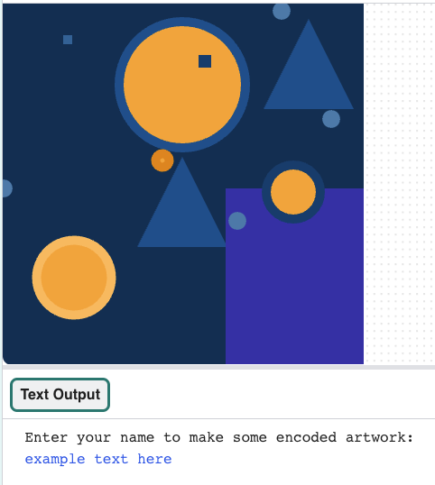

## Encode a message

Use the dictionary to encode text by placing shapes for each character in the message.

--- task ---

**Remove** the test shape calls in your `draw()` function by **commenting them out** with a hashtag at the start of each line:

--- code ---
---
language: python
filename: main.py - draw()
line_numbers: false
line_number_start: 
line_highlights: 
---
#shape_1(primary_2, 100)
#shape_2(primary_2, 200)
#shape_3(complementary_2, 100)

--- /code ---

--- /task ---

--- task ---
**Choose** what text you will ask the user to provide to be encoded. It could be their:
+ Name
+ Favourite song lyric
+ Favourite quote

--- /task ---

--- task ---

**Create** an `input()` call for the user to be able to type in their message when the program runs.  
This needs to go before your `run()` call, outside of any function definitions.

--- code ---
---
language: python
filename: main.py
line_numbers: false
line_number_start: 
line_highlights: 
---

name = input()

run()
--- /code ---

Add a `print` statement before the `input()` call, to prompt the user to enter some text when the program runs:

--- code ---
---
language: python
filename: main.py
line_numbers: false
line_number_start: 
line_highlights: 
---

print('Type some text and press Enter to generate an encoded artwork:')
name = input()

run()
--- /code ---

--- /task ---

--- task ---

In the `draw()` function (after your dictionary), call the global variable you just declared and make sure that all the letters are the same case. 

--- code ---
---
language: python
filename: main.py - draw()
line_numbers: false
line_number_start: 
line_highlights: 
---
global name

name = name.lower()

--- /code ---

If your dictionary is in lower case, you should use `name.lower()`, but if you entered the letters in upper case you should use `name.upper()`. 

--- /task ---

--- task ---

**Create** a list to hold the series of letters in the message ready to encode, then populate the list by using `append` to add the coded dictionary values for each letter. **Append** literally means **add to the end** of something.

--- code ---
---
language: python
filename: main.py - draw()
line_numbers: false
line_number_start: 
line_highlights: 
---

global name

name = name.lower()

message = [] # list for the encoded letters

for letter in name:
    message.append(code[letter]) # add the encoded letter to the list
--- /code ---

--- /task ---

--- task ---

**Create** a for loop that will print each item in your `message` list and then run your code to see the output. 

--- code ---
---
language: python
filename: main.py - draw()
line_numbers: false
line_number_start: 
line_highlights: 
---
for item in message:
  print(item)
--- /code ---

--- /task ---

--- task ---

**Edit** your for loop so that it will individually check the list of coded values based on the first term in each entry, then pass the information into your shape functions to draw a shape for each letter and place it on your canvas.

--- code ---
---
language: python
filename: main.py - draw()
line_numbers: false
line_number_start: 
line_highlights: 2-7
---
for item in message:
  if item[0] == 'shape 1':
    shape_1(item[1], item[2])
  elif item[0] == 'shape 2':
    shape_2(item[1], item[2])
  elif item[0] == 'shape 3':
    shape_3(item[1], item[2])

--- /code ---

**Optional**: If you have chosen to place your shapes in a line instead of in random locations then add the code for placing shapes in a line. 

--- collapse ---
---
title: Place shapes in a line
---
If you are using specific coordinates to place your shapes, you will need to change the global `startx` and `starty` values inside your `for` loop and pass them back into your functions each time. 

You need the `x` coordinate of each shape to change by the `size` of the last shape, to make sure they line up nicely.

You will also need to check whether your next shape is about to be drawn outside your window by calling the `size_check()` function you created earlier (which will move the next shape to the 'next line' on your window):

--- code ---
---
language: python
filename: main.py - draw()
line_numbers: false
line_number_start: 1
line_highlights: 3-4, 7-8, 11-12
---
for item in message:
  if item[0] == 'shape 1':
    shape_1(item[1], item[2]) 
    startx += item[1] 
    size_check() # Check to see if you've gone off the side of the window
  elif item[0] == 'shape 2':
    shape_2(item[1], item[2])
    startx += item[1]
    size_check()
  elif item[0] == 'shape 3':
    shape_3(item[1], item[2])
    startx += item[1]
    size_check()

--- /code ---

--- /collapse ---

--- /task ---

--- task ---

**Test** your code to see if it displays your chosen images on the screen. At this point they should all appear in the way you expect.

{:width="400px"}

--- /task ---

--- task ---

**Debug:**

--- collapse ---
---
title: I get an error about `name` referenced before assignment
---
Make sure you have `name` set up as a `global` variable in your draw function.

--- /collapse ---

--- collapse ---
---
title: My art doesn't look as I expected
---
Make sure your arguments are called in the right order in your function calls and match the order in your function definitions, and you are using the correct indexes for the lists.

`def shape_2(size, color):`

This function places size first and color second.

When calling `shape_2` you need to pass arguments in, in the same order as they are in the definition.

`shape_2(item[1], item[2])` is calling the shape_2 function with a size of `item[1]` and a colour of 0`item[2]`.

`['shape 1', 20, -11696205]`

Here, `item[1]` would be `20` and `item[2]` would be `-11696205`.

--- /collapse ---

--- /task ---

--- save ---
