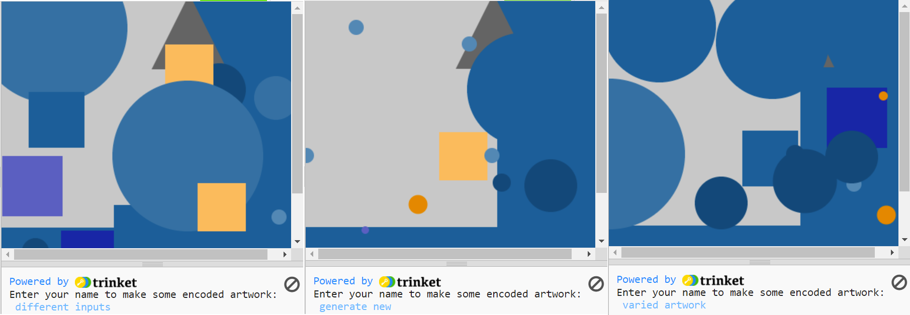

## Encode a message

Use the dictionary to encode text by placing shapes for each character in the message.

--- task ---

**Remove** the test shape calls in your `draw()` function by **commenting them out** with a hashtag at the start of each line:

--- code ---
---
language: python
filename: main.py - draw()
line_numbers: false
line_number_start: 
line_highlights: 
---
#shape_1(primary_2, 100)
#shape_2(primary_2, 200)
#shape_3(complementary_2, 100)

--- /code ---

--- /task ---

--- task ---
**Choose** what you will ask your user about the text they will enter. It could be their:
+ Name
+ Favourite song lyric
+ Favourite quote

--- /task ---

--- task ---

**Create** an `input()` call for the user to be able to type in their message when the program runs.  
This needs to go before your `run()` call, outside of any function definitions.

--- code ---
---
language: python
filename: main.py
line_numbers: false
line_number_start: 
line_highlights: 
---

name = input()

run()
--- /code ---

Add a `print` statement before the `input()` call, to prompt the user to enter some text when the program runs:

--- code ---
---
language: python
filename: main.py
line_numbers: false
line_number_start: 
line_highlights: 
---

print('Type some text and press Enter to generate an encoded artwork:')
name = input()

run()
--- /code ---

--- /task ---

--- task ---

At the end of your `draw()` function (after your dictionary), call the global variable you just declared and make sure that all the letters are the same case. 

--- collapse ---
---
title: Matching the case of the input to your dictionary keys 
---

--- code ---
---
language: python
filename: main.py - draw()
line_numbers: false
line_number_start: 
line_highlights: 
---
global name

name = name.lower()

--- /code ---

If your dictionary is in lowercase you should use `name.lower()`, but if you entered the letters in uppercase you should use `name.upper()`. 

--- /collapse ---

--- /task ---

--- task ---

**Create** a list to hold the series of letters in the message ready to encode, then populate the list by using `append` to add the coded dictionary values for each letter. **Append** literally means **add to the end** of something.

--- collapse ---
---
title: Encode and Append to a list
---

--- code ---
---
language: python
filename: main.py - draw()
line_numbers: false
line_number_start: 
line_highlights: 
---

global name

name = name.lower()

message = []

for letter in name:
    message.append(code[letter])
--- /code ---

--- /collapse ---

--- /task ---

--- task ---

**Create** a `for` loop which will individually check the list of coded values based on the first term in each entry, then pass the information into your shape functions to draw a shape for each letter and place it on your canvas.

--- collapse ---
---
title: Drawing a shape for each letter 
---

--- code ---
---
language: python
filename: main.py - draw()
line_numbers: false
line_number_start: 
line_highlights: 
---
for item in message:
  if item[0] == 'shape 1':
    shape_1(item[1], item[2])
  elif item[0] == 'shape 2':
    shape_2(item[1], item[2])
  elif item[0] == 'shape 3':
    shape_3(item[1], item[2])

--- /code ---

--- /collapse ---

--- collapse ---
---
title: Iterating coordinates for linear placement
---
If you are using specific coordinates to place your shapes, you will need to change the global `startx` and `starty` values inside your `for` loop and pass them back into your functions each time. 

You need the `x` coordinate of each shape to change by the `size` of the last shape, to make sure they line up nicely.

You will also need to check whether your next shape is about to be drawn outside your window by calling the `check_size()` function you created earlier (which will move the next shape to the 'next line' on your window):

--- code ---
---
language: python
filename: main.py - draw()
line_numbers: false
line_number_start: 1
line_highlights: 3-4
---
for item in message:
  if item[0] == 'shape 1':
    shape_1(item[1], item[2]) 
    startx += item[1] 
    size_check() # Check to see if you've gone off the side of the window
  elif item[0] == 'shape 2':
    shape_2(item[1], item[2])
    startx += item[1]
    size_check()
  elif item[0] == 'shape 3':
    shape_3(item[1], item[2])
    startx += item[1]
    size_check()

--- /code ---

--- /collapse ---

--- /task ---

--- task ---

**Test** your code to see if it displays your chosen images on the screen. At this point they should all appear in the way you expect.

{:width="400px"}

--- /task ---

--- task ---

**Debug:**

--- collapse ---
---
title: I'm getting an error about '`name` referenced before assignment'
---
Make sure you have `name` set up as a `global` variable in your draw function.

--- /collapse ---

--- collapse ---
---
title: My art looks weird!
---
Make sure your parameters are being called in the right order in your functions.

--- /collapse ---

--- /task ---

--- save ---
