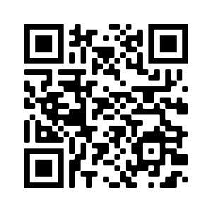

## Ce que tu vas faire

Créer une œuvre d’art codée basée sur le nom de l’utilisateur. Chaque lettre est codée selon une forme qui s'affiche de manière aléatoire sur l'écran.

Dans ce projet, tu vas :
+ Utiliser un dictionnaire pour coder des lettres avec une variété de formes
+ Utiliser des fonctions avec des paramètres pour ajouter une personnalisation aux formes
+ Créer une œuvre d'art numérique unique en utilisant des lettres codées

Le codage consiste à convertir des données d'une forme à une autre. **Les codes QR** sont comme une petite œuvre d'art **codée**. Ils sont utilisés pour représenter des données, telles que des adresses de sites web ou du texte. Ils sont constitués de carrés noirs et blancs qui servent à représenter des lettres ou des chiffres. Les motifs en noir et blanc peuvent être lus et décodés par les ordinateurs.

{:width="200px"}

### Trouve l'inspiration 💭

Tu vas prendre des décisions de conception concernant le type d’œuvre d’art qui sera produite lorsque l’utilisateur entrera son nom.

--- task ---

Regarde ces exemples. Pense à ton arrière-plan et demande-toi si ta conception comprendra des formes, des motifs, des images ou une combinaison.

**Cercles, carrés et triangles :** [Voir à l'intérieur](https://editor.raspberrypi.org/en/projects/circles-squares-triangles){:target="_blank"}

<iframe src="https://editor.raspberrypi.org/en/embed/viewer/circles-squares-triangles" width="600" height="600" frameborder="0" marginwidth="0" marginheight="0" allowfullscreen>
</iframe>

**Perdu dans l'espace :** [Voir à l'intérieur](https://editor.raspberrypi.org/en/projects/lost-in-space){:target="_blank"}

<iframe src="https://editor.raspberrypi.org/en/embed/viewer/lost-in-space" width="600" height="600" frameborder="0" marginwidth="0" marginheight="0" allowfullscreen>
</iframe>

**Tous les fruits ! :** [Voir à l'intérieur](https://editor.raspberrypi.org/en/projects/all-the-fruit){:target="_blank"}

<iframe src="https://editor.raspberrypi.org/en/embed/viewer/all-the-fruit" width="600" height="600" frameborder="0" marginwidth="0" marginheight="0" allowfullscreen>
</iframe>

**Motifs géométriques :** [Voir à l'intérieur](https://editor.raspberrypi.org/en/projects/geometric-patterns-example){:target="_blank"}

<iframe src="https://editor.raspberrypi.org/en/embed/viewer/geometric-patterns-example" width="600" height="600" frameborder="0" marginwidth="0" marginheight="0" allowfullscreen>
</iframe>

--- /task ---

