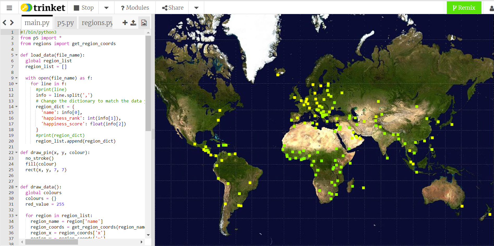

## Et ensuite ?

Si tu suis le parcours [Plus de Python](https://projects.raspberrypi.org/en/raspberrypi/more-python), tu peux passer au projet [Données cartographiques](https://projects.raspberrypi.org/en/projects/mapping-data). Dans ce projet, tu vas créer une carte qui trace différents points de données du monde entier.

--- print-only ---

--- /print-only ---

--- no-print ---

<iframe src="https://editor.raspberrypi.org/en/embed/viewer/urban-rural-population" width="600" height="600" frameborder="0" marginwidth="0" marginheight="0" allowfullscreen>
</iframe>

--- /no-print ---

Si tu veux t'amuser davantage en explorant Python, tu peux essayer l'un de ces [projets](https://projects.raspberrypi.org/en/projects?software%5B%5D=python&curriculum%5B%5D=%202).
