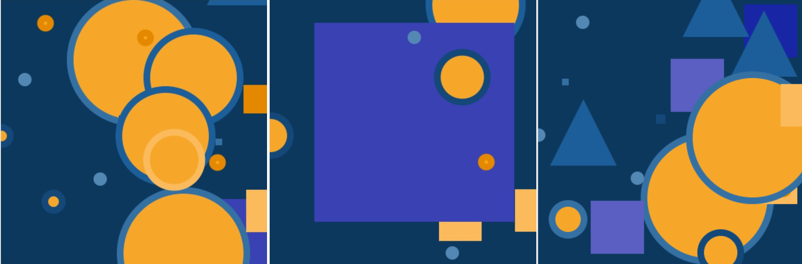

## Choisir un thème

As-tu des idées sur le type d’art que tu aimerais réaliser ? Dans cette étape, tu planifieras ton art et configureras ton arrière-plan.

--- task ---

Ouvre le [projet de démarrage](https://editor.raspberrypi.org/en/projects/encoded-art-starter){:target="_blank"}. Le Code Editor Raspberry Pi s'ouvre dans un autre onglet.

--- /task ---

--- task ---

**Choisir :** pense au type d'art que tu souhaites réaliser :
+ Veux-tu choisir quelque chose de ton patrimoine ou de ta culture populaire ?
+ Ton art importera-t-il des images existantes ou dessinera-t-il des formes géométriques ?
+ Quelles couleurs souhaites-tu utiliser ?
+ Ton arrière-plan sera-t-il de couleur unie ou composé de plusieurs formes colorées ?

--- /task ---

La première chose à faire lors de la création artistique à l'aide de la `bibliothèque de traitement` Python est d'ajouter `def setup():` pour définir une fonction `setup` qui est exécutée une fois au début de ton programme.

--- task ---

**Créer :** définis la fonction `setup()` dans ton code pour définir la taille de la fenêtre de sortie. La fonction `size()` est utilisée pour indiquer la taille du canevas. Les arguments indiquent la largeur et la hauteur en pixels.

--- collapse ---
---
title: Définir la taille de l'écran au démarrage de ton programme
---

--- code ---
---
language: python filename: main.py - setup() line_numbers: false line_number_start:
line_highlights: 1-2
---
def setup():   
size(400, 400) # 400 by 400 works well for an art canvas

--- /code ---

--- /collapse ---

--- /task ---

--- task ---

**Choisir :** expérimente avec les nombres dans ta fonction `setup()` et exécute ton code pour trouver une taille qui te convient.

--- /task ---

La fonction `draw()` exécute continuellement les lignes de code contenues dans son bloc jusqu'à ce que le programme soit arrêté. Elle est automatiquement appelée directement après `setup()`.

--- task ---

**Créer :** définis la fonction `draw` dans ton script.

--- /task ---

--- task ---

**Choisir :** pense aux couleurs que tu utiliseras pour ton art et crée des variables qui contiendront les valeurs de couleur au début de `draw()`.

[[[generic-theory-simple-colours]]]

Tu peux également utiliser quelque chose comme le [Concepteur de schémas de couleurs Paletton](https://paletton.com/){:target="_blank"} pour choisir ta palette de couleurs et copier les valeurs RVB.

--- collapse ---

---
title: Couleur en p5
---

La fonction p5 Color() attend trois nombres : un pour le rouge, le vert et le bleu.

--- code ---
---
language: python filename: main.py line_numbers: false line_number_start:
line_highlights: 1
---
blue = Color(50, 70, 206) #Red = 50, Green = 70, Blue = 206

--- /code ---

--- /collapse ---

--- /task ---

Tu remarqueras peut-être deux orthographes du mot **color** (couleur) dans ce projet. La plus courte, color, est l'orthographe préférée aux États-Unis. D'autres pays peuvent utiliser la forme plus longue, colour. Tout code prédéfini, comme `Color()`, utilise généralement l'orthographe américaine.

--- task ---

**Crée** une fonction qui **dessinera une forme d'arrière-plan** à l'aide de ta palette de couleurs. Ensuite, ajoute un appel à ta fonction `draw()` .

--- collapse ---
---
title : Définir les couleurs d’arrière-plan au démarrage de ton programme
---

Au-dessus de ta fonction `draw()` , définis une nouvelle fonction appelée `dessine_arriere_plan()` et crée un appel vers celle-ci dans `draw():`, après un appel à `no_stroke()`.

--- code ---
---
language: python filename: main.py - draw_background() line_numbers: false line_number_start:
line_highlights: 1-4
---
def draw_background(colour): # Background colour fill(colour) rect(0, 0, 400, 400)

--- /code ---

Puis crée un appel avec `draw()`:

--- code ---
---
language: python filename: main.py - draw() line_numbers: false line_number_start:
line_highlights: 8
---
def draw():

    red = Color(255,0,0)
    green = Color(0,255,0)
    blue = Color(0,0,255)
    
    no_stroke()
    draw_background(red)

--- /code ---

Si tu veux que ton arrière-plan inclue plus de couleurs, tu devras ajouter plus de paramètres.

--- code ---
---
language: python filename: main.py - draw_background() line_numbers: false line_number_start:
line_highlights: 1, 6-7
---
def draw_background(green, blue):

    # Background colour
    fill(blue)
    rect(0, 0, 400, 200)
    fill(green)
    rect(0, 200, 400, 200)

--- /code ---

Ensuite, ajoute la nouvelle couleur à ton appel `dessine_arriere_plan()` dans `draw()`:

--- code ---
---
language: python filename: main.py - draw() line_numbers: false line_number_start:
line_highlights: 8
---
def draw():

    red = Color(255, 0, 0)
    green = Color(0, 255, 0)
    blue = Color(0, 0, 255)
    
    no_stroke()
    draw_background(green, blue)

--- /code ---

--- /collapse ---

--- /task ---

--- task ---

**Crée** un appel à `run()` à la toute fin de ton script (sans retrait !) pour exécuter le programme :

--- code ---
---
language: python filename: main.py line_numbers: false line_number_start: 1
line_highlights: 1
---
run()

--- /code ---

--- /task ---

--- task ---

**Test :** exécute ton projet pour voir la taille d'écran et la couleur d'arrière-plan que tu as choisies.

--- /task ---

--- task ---

**Débogage :** il est possible que tu trouves des bogues dans ton projet que tu dois corriger. Voici quelques bogues courants.

--- collapse ---
---
title: J'ai mis à jour ma taille et ma couleur, mais la zone de sortie reste la même
---

Après avoir modifié le code, tu devras exécuter (`run`) ton projet pour voir les changements dans la zone de sortie.

Assure-toi d'avoir un appel à `run()` à la toute fin de ton script en dehors de l'une de tes définitions de fonction (non en retrait).

--- /collapse ---

--- collapse ---
---
title: J'ai essayé différents numéros, mais la couleur d'arrière-plan ne change pas
---

La quantité maximale de rouge, de vert ou de bleu est de `255`. Assure-toi que toutes tes valeurs de couleur `d'arrière-plan` sont comprises entre `0` et `255`.

--- /collapse ---

--- /task ---

--- save ---
