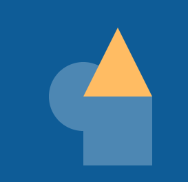

## Dessiner tes formes

Configure tes fonctions de forme afin de pouvoir les utiliser dans tes illustrations codées. 

{:width="300px"}

--- task ---

Décide du nombre de **formes** uniques que tu souhaites que ton œuvre d'art ait. Les exemples de projets ont **trois** formes uniques. Celles-ci sont ensuite modifiées à l'aide des paramètres de la fonction. Tu aimerais peut-être en avoir plus de trois, c'est à toi de décider !

Voici quelques idées :
+ Trois fonctions de forme qui chargent des images de papillons, d'escargots ou d'oiseaux
+ Trois fonctions de forme qui dessinent des carrés, des cercles et des triangles
+ Cinq fonctions de forme, chacune dessine un animal unique

--- /task ---

--- task ---

**Définis** chaque fonction de forme en vue de l'ajout du code qui sera nécessaire pour dessiner chaque forme. Assure-toi de définir tes fonctions de forme **au-dessus de** ta fonction `draw()` .

--- collapse ---
---
title: Définir tes fonctions
---
Tu peux définir tes fonctions de la manière suivante :

--- code ---
---
language: python
filename: main.py
line_numbers: false
line_number_start: 
line_highlights: 
---
def forme_1():

def forme_2():

def forme_3():

--- /code ---

--- /collapse ---

--- /task ---

--- task ---

Décide de quels **paramètres** tes fonctions auront besoin. Voici quelques idées :
+ Un paramètre `couleur` pour te permettre de modifier la couleur des formes que tu as créées
+ Un paramètre `size` pour te permettre d'ajuster la taille de la forme ou de l'image.
+ Un paramètre `contour` qui ajoute une couleur différente au bord d'un dessin

--- /task ---

--- task ---

**Ajoute** les paramètres **que tu as choisis** à l'intérieur des parenthèses de chacune de tes fonctions **de forme** .

--- collapse ---
---
title: Ajouter des paramètres à tes fonctions
---
Tu peux ajouter des paramètres à tes fonctions de la manière suivante :

--- code ---
---
language: python
filename: main.py
line_numbers: false
line_number_start: 
line_highlights: 
---
def forme_1(taille, couleur):

def forme_2(taille, contour):

def forme_3(objet, couleur):

--- /code ---

--- /collapse ---

--- /task ---

--- task ---

**Ajoute** dans le code pour chacune de tes fonctions de forme afin que le dessin ou l'image apparaisse lorsque la fonction est **appelée**.

Choisir : à quoi ressemble ta forme ? Ta forme pourrait être :
  - Une image fournie dans le projet de démarrage
  - Un emoji 🎈 ou un texte
  - Un dessin utilisant une série de formes géométriques

Dans le projet [Créer un visage](https://projects.raspberrypi.org/fr-FR/projects/make-a-face/0){:target="_blank"}, tu as appris à utiliser un groupe de formes géométriques pour créer des visages amusants. Tu peux utiliser tes compétences de ce projet pour t'aider à dessiner tes images.

### Formes

[[[processing-python-ellipse]]]

[[[processing-python-rect]]]

[[[processing-python-triangle]]]

[[[processing-python-quad]]]

[[[processing-translation]]]

[[[processing-rotation]]]

### Couleurs et effets

[[[generic-theory-simple-colours]]]

[[[processing-opacity]]]

[[[processing-stroke]]]

[[[processing-tint]]]

### Exemples

Voici un exemple de code pour dessiner un carré dans ton projet artistique codé :

--- code ---
---
language: python
filename: main.py - shape_2()
line_numbers: false
line_number_start: 
line_highlights: 
---
def forme_2(couleur, taille):

    fill(couleur)   
    rect(200, 200, taille, taille)

--- /code ---

**Note** que les paramètres définis dans la fonction ci-dessus sont ensuite utilisés pour dessiner la forme.

--- collapse ---
---
title: Charger une image
---

L'exemple de projet [Perdu dans l'espace](https://editor.raspberrypi.org/fr-FR/projects/lost-in-space){:target="_blank"} charge des images pour créer l'illustration codée.

**Rappelle-toi** que tu auras besoin de code pour afficher l'image :

--- code ---
---
language: python
filename: main.py - shape_1()
line_numbers: false
---
def forme_1(taille, couleur): 

    if couleur == 'violet':
        image(purple_planet, 400, 400, taille, taille) 
    elif couleur == 'orange':
        image(orange_planet, 400, 400, taille, taille)
    elif couleur == 'vert':
        image(green_planet, 400, 400, taille, taille)
    elif couleur == 'gris':
        image(grey_moon, 400, 400, taille, taille)

--- /code ---

Tu auras également besoin de code pour **charger** l'image dans la fonction `setup()` :

--- code ---
---
language: python
filename: main.py - setup()
line_numbers: false
---
def setup():

    # Autoriser d'autres fonctions à accéder aux images
    global planete_violette
    
    frame_rate(10)
    size(400, 400)
    
    # Charger les images nécessaires dans les variables
    planete_violette = load_image('purple_planet.png')
    planete_orange = load_image('orange_planet.png')
    planete_verte = load_image('green_planet.png')
    lune_grise = load_image('moon.png')

--- /code ---

--- /collapse ---

--- collapse ---

---
title: Utiliser les caractères emoji
---

Tu peux utiliser des caractères emoji dans la fonction p5 text() pour utiliser un emoji pour représenter ton joueur.

Voici un exemple :

--- code ---
---
language: python
filename: main.py
line_numbers: 
line_number_start: 
line_highlights: 
---
def setup():
    size(400, 400)
    text_align(CENTER, TOP) # Position autour du centre

def dessin_emoji(emoji, taille): # serpent
    text_size(taille) # Contrôle la taille de l'emoji
    text(emoji, 200, 200)

--- /code ---

--- /collapse ---

--- /task ---

--- task ---

Pour **tester** que tes fonctions de forme fonctionnent correctement, tu auras besoin de **les appeler** à partir de la fonction `draw()`. Rappelle-toi que tu peux utiliser le `#` pour commenter des lignes de code afin de ne voir qu'une forme à la fois.

Assure-toi d'ajouter les arguments pour les paramètres choisis !

L'exemple ci-dessous prend deux ou trois arguments.

--- code ---
---
language: python
filename: main.py
line_numbers: false
line_number_start: 
line_highlights: 
---

    forme_1(100, couleur_1)
    forme_2(100, couleur_2)
    dessin_emoji('🐍', 100)

--- /code ---

**Remarque** que les noms de variables pour la `couleur` choisie ont été placés dans le premier paramètre et que certaines valeurs ont été ajoutées pour la `taille` choisie dans le second paramètre.

--- /task ---

Le prototypage consiste à faire une ébauche de ce que tu penses que ton projet final pourrait réaliser. L'objectif du prototypage est de créer une version simplifiée du produit final, pour te permettre de tester s'il s'agit d'une solution viable au problème.

--- task ---

**Teste** ton code pour voir s'il affiche les images que tu as choisies à l'écran. À ce stade, ils pourraient tous apparaître les uns sur les autres. Tu peux **appeler** chaque fonction séparément pour les voir plus clairement.

--- /task ---

--- task ---

**Débogage :**

--- collapse ---
---
title: Tu vois une erreur concernant les arguments
---
+ Lorsque tu as **défini** ta fonction, tu as décidé du nombre de **paramètres** dont elle avait besoin. Tu dois t'assurer que lorsque tu appelles la fonction, elle a le même nombre **d'arguments**.

--- /collapse ---

--- collapse ---
---
title: Une seule forme apparaît
---
+ Vérifie que tu as **appelé** chaque fonction de forme.
+ Les formes peuvent être présentes, mais superposées. Pour changer cela, tu peux appeler une fonction à la fois en commentant les deux autres appels de fonction avec un hashtag `#`.

--- /collapse ---

--- collapse ---
---
title: Les dessins ne sont pas la bonne forme/taille
---
+ Vérifie que tu as saisi tes **arguments** dans l'appel de fonction dans le même ordre que les **paramètres** dans la fonction.

--- /collapse ---

--- /task ---

--- save ---
