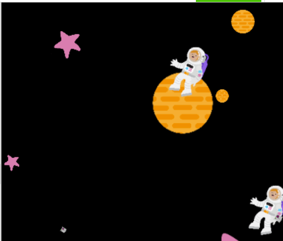
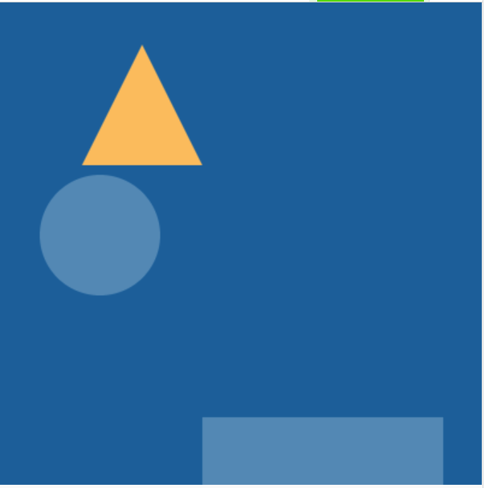

## Placer tes formes

Maintenant que tu as des formes reproductibles pour ton œuvre, tu dois les placer sur le canevas.

{:width="300px"}

--- task ---

**Choisir :** Comment vas-tu placer tes formes sur le canevas ? Est-ce que ce sera aléatoire ou auront-ils un modèle spécifique ?

--- /task ---

--- task ---

**Décide** où tu souhaites que tes formes apparaissent dans la fenêtre. Elles pourraient apparaître :

+ Au hasard autour de la fenêtre
+ En séquence de gauche à droite
+ Au même endroit à chaque fois
+ Vers un autre modèle défini

[[[using-seed-in-python]]]

--- collapse ---
---
title: Positionner les formes de manière aléatoire
---

Depuis la bibliothèque `random`, importe `randint` et `seed` en haut de ton script.

--- code ---
---
language: python
filename: main.py
line_numbers: false
---
from random import randint, seed

--- /code ---

**Ajoute** un appel à `seed()` dans ton `draw()` sous `dessine_arriere_plan ()`. Tu devras saisir un argument pour la seed, qui peut être n'importe quel nombre :

--- code ---
---
language: python
filename: main.py - draw()
line_numbers: false
line_number_start: 
line_highlights: 
---

    dessine_arriere_plan(rouge)
    seed(32)

--- /code ---

Modifie tes fonctions de forme pour définir des coordonnées aléatoires pour chaque forme lors du dessin :

--- code ---
---
language: python
filename: main.py - shape_1()
line_numbers: false
line_number_start: 1 
line_highlights: 
---
def forme_1(couleur, taille):

    fill(couleur)   
    ellipse(200, 200, taille, taille)
--- /code ---

Devient :

--- code ---
---
language: python
filename: main.py - shape_1()
line_numbers: false
line_number_start: 1
line_highlights: 3-4
---
def forme_1(couleur, taille):

    x = randint(0, 400)
    y = randint(0, 400)
    fill(couleur)   
    ellipse(x, y, taille, taille)
--- /code ---

--- /collapse ---

--- collapse ---
---
title: Utiliser des coordonnées pour positionner les formes en groupes
---
Certaines formes de la bibliothèque `p5` nécessitent que tous leurs coins soient déclarés, en particulier `triangles` et `quads`. Pour randomiser leurs positions, tu dois faire quelques calculs rapides.

Par exemple :

--- code ---
---
language: python
filename: main.py
line_numbers: false
line_number_start: 
line_highlights: 
---
def forme_1(couleur)
    fill(couleur)
    triangle(200, 200, 250, 100, 300, 200)

--- /code ---

Devient :

--- code ---
---
language: python
filename: main.py
line_numbers: false
line_number_start: 
line_highlights: 
---
def forme_1(couleur, x, y):
    fill(couleur)
    x = randint(0, 400)
    y = randint(0, 400)
    triangle(x - 5, y - 35, x + 5, y - 75, x + 20, y - 75)
--- /code ---

--- /collapse ---

--- collapse ---
---
title: Créer un modèle de positionnement spécifique
---

Si tu jettes un coup d'œil à **Motifs géométriques :**, tu remarqueras qu'il place les formes sur la page puis vers le bas, comme du texte :

[Voir à l'intérieur](https://editor.raspberrypi.org/fr-FR/projects/geometric-patterns-example){:target="_blank"}

<iframe src="https://editor.raspberrypi.org/fr-FR/embed/viewer/geometric-patterns-example" width="600" height="600" frameborder="0" marginwidth="0" marginheight="0" allowfullscreen>
</iframe>

Ceci peut être réalisé en créant des variables globales dans ta boucle de dessin appelée `startx` et `starty`, puis les mettre toutes les deux à `0` :

--- code ---
---
language: python
filename: main.py - draw()
line_numbers: false
line_number_start: 
line_highlights: 
---
global startx, starty
startx = 0
starty = 0

--- /code ---

Ces variables seront utilisées pour itérer les valeurs `x` et `y` pour chaque forme de la fonction de menu principale que tu vas écrire plus tard. Dans chacune de tes fonctions de forme, change les valeurs `x` et `y` pour utiliser ces variables globales.

--- code ---
---
language: python
filename: main.py - shape_2()
line_numbers: false
line_number_start: 
line_highlights: 
---
def forme_2(couleur, taille):

    x = randint(0, 400)
    y = randint(0, 400)
    fill(couleur)   
    rect(x, y, taille, taille)
--- /code ---

Devient :

--- code ---
---
language: python
filename: main.py - shape_2()
line_numbers: false
line_number_start: 
line_highlights: 
---
def forme_2(couleur, taille): 

    global startx
    global starty
    x = startx
    y = starty
    fill(couleur)   
    rect(x, y, taille, taille)
--- /code ---

Parce que tu dois détecter si les formes vont sortir "du côté" du canevas, crée une fonction pour vérifier que la coordonnée `x` de la forme suivante est inférieure à la taille de ta fenêtre et la remettre à 0 si ce n'est pas le cas, tout en la déplaçant vers le bas de la fenêtre en augmentant la coordonnée `y` initiale de la forme.

**Définis** une nouvelle fonction appelée `taille_test()` maintenant :

--- code ---
---
language: python
filename: main.py - size_check()
line_numbers: false
line_number_start: 
line_highlights: 
---
def taille_test():

    global startx
    global starty
    if startx >= 400:
        startx = 0
        starty +=80

--- /code ---

**Astuce :** recherche plus d'instructions sur l'appel de cette fonction lors du codage de la boucle d'entrée lors de l'étape **Coder un message** !

--- /collapse ---

--- /task ---

--- task ---

**Teste** ton code pour voir s'il affiche les images que tu as choisies à l'écran comme tu le souhaites.

Si tu as utilisé un motif aléatoire, expérimente la valeur `seed()` pour changer le motif !

--- /task ---

--- task ---

**Débogage :**

--- collapse ---
---
title: J'ai une erreur à propos de `randint` ou `seed`
---
Assure-toi que tu as importé `randint` et `seed` de la bibliothèque `random` en haut de ton script : `from random import randint, seed`.

--- /collapse ---

--- collapse ---
---
title: Le motif n'est pas différent de la dernière fois
---
Assure-toi que tes fonctions de forme contiennent les lignes `x = randint(0,400)` et `y = randint(0, 400)` et les paramètres de forme sont définis à `x` et `y`, pas des nombres : `rect(x, y, taille, taille)`

--- /collapse ---

--- collapse ---
---
title: Mes formes se déplacent très vite
---
Assure-toi d'avoir inclus un appel à `seed()` dans ta fonction `draw()` , qui inclut un nombre en tant qu'argument : `seed(72)`

--- /collapse ---

--- /task ---

--- save ---
