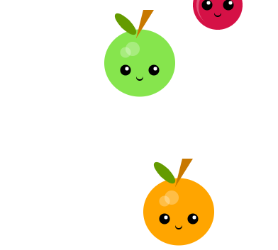

## Créer ton dictionnaire

Crée le dictionnaire qui codera chaque lettre de l'alphabet avec une forme. 

{:width="300px"}

--- task ---

**Définis** ton **dictionnaire** dans la fonction `draw()` . Assure-toi de lui donner un nom approprié et place le dictionnaire sous ta palette de couleurs mais au-dessus du reste du code que tu as ajouté.

--- collapse ---
---
title: Définir un dictionnaire
---
Voici un exemple de code de définition d'un dictionnaire :

--- code ---
---
language: python
filename: main.py
line_numbers: false
line_number_start: 
line_highlights: 
---
code = {

}

--- /code ---

--- /collapse ---

--- /task ---

--- task ---

**Ajoute** toutes les lettres de l'alphabet comme **clés** dans le dictionnaire. Sois prudent avec la syntaxe que tu utilises. Il est très facile de manquer un deux-points `:` ou une virgule `,`.

--- collapse ---
---
title: Ajouter des clés à un dictionnaire
---
Voici un exemple de code montrant les **clés** ajoutées à un **dictionnaire** :

--- code ---
---
language: python
filename: main.py
line_numbers: false
line_number_start: 
line_highlights: 
---
code = {
    'a': ,
    'b': ,
    'c': ,
    'd': ,
    'e': ,
    'f': ,
    'g': ,
    'h': ,
    'i': ,
    'j': ,
    'k': ,
    'l': ,
    'm': ,
    'n': ,
    'o': ,
    'p': ,
    'q': ,
    'r': ,
    's': ,
    't': ,
    'u': ,
    'v': ,
    'w': ,
    'x': ,
    'y': ,
    'z': ,
    ' ': ,
    
}
--- /code ---

**Note** que le jumelage de données n'a pas encore été saisi. Tu le feras dans la tâche suivante.

--- /collapse ---

--- /task ---

--- task ---

Chaque lettre de l'alphabet doit être **associée** à la forme **choisie** et à tous les arguments que tu dois transmettre à la fonction. Tu peux le faire en saisissant ces données dans une liste.

La liste devra contenir :
+ Le nom de la fonction de forme sous forme de chaîne, par exemple `'forme_1'`
+ Les valeurs des arguments dont ta fonction de forme a besoin, par exemple `100` pour la taille de la forme

--- collapse ---
---
title: Associer une liste à tes clés de dictionnaire
---

Voici un exemple d'une **liste** associée aux lettres de l'alphabet. Tu peux voir que chaque liste contient **trois** éléments : le **nom de la fonction**, la valeur de la **taille** et l'`objet` choisi à afficher.

--- code ---
---
language: python
filename: main.py
line_numbers: false
line_number_start: 
line_highlights: 
---
  code = {
    'a': ['forme 3', 150, 'rose'],
    'b': ['forme 3', 50, 'jaune'],
    'c': ['forme 2', 75, 'astronaute'],
    'd': ['forme 2', 80, 'astropi'],
    'e': ['forme 1', 20, 'orange'],
    'f': ['forme 2', 80, 'satellite'],
    'g': ['forme 1', 10, 'violet'],
    'h': ['forme 1', 300, 'vert'],
    'i': ['forme 1', 200, 'orange'],
    'j': ['forme 2', 90, 'astropi'],
    'k': ['forme 1', 12, 'violet'],
    'l': ['forme 3', 43, 'rose'],
    'm': ['forme 1', 93, 'orange'],
    'n': ['forme 1', 64, 'vert'],
    'o': ['forme 3', 85, 'bleu'],
    'p': ['forme 2', 10, 'astropi'],
    'q': ['forme 3', 45, 'bleu'],
    'r': ['forme 1', 70, 'violet'],
    's': ['forme 1', 36, 'orange'],
    't': ['forme 2', 74, 'astronaute'],
    'u': ['forme 1', 58, 'gris'],
    'v': ['forme 3', 78, 'jaune'],
    'w': ['forme 1', 24, 'orange'],
    'x': ['forme 2', 14, 'astropi'],
    'y': ['forme 1', 67, 'violet'],
    'z': ['forme 2', 70, 'astropi'],
    ' ': ['forme 3', 25, 'rose']
}

--- /code ---

--- /collapse ---

--- /task ---

--- task ---

**Débogage :** **exécute** et **teste** ton code. Il ne devrait pas y avoir de différence à ce stade. C'est l'occasion de voir si tu as des **erreurs de syntaxe** dans ton dictionnaire.

--- collapse ---
---
title: Corriger les erreurs de syntaxe
---

Si ton code comporte des erreurs de syntaxe, examine très attentivement la structure de ton dictionnaire. Il devrait y avoir :
+ Des accolades `{}` au début et à la fin du dictionnaire
+ Des apostrophes `'` entourant les clés (lettres de l'alphabet)
+ Un deux-points `:` entre la clé et la liste
+ La liste devrait avoir un crochet `[]` de chaque côté
+ Chaque élément de liste doit être séparé par une virgule `,`
+ Il devrait y avoir une virgule `,` à la fin de chaque **paire clé-valeur**

Tu peux revérifier ta syntaxe en jetant un œil à l'exemple de code dans **Associer une liste avec tes clés de dictionnaire** ci-dessus.

--- /collapse ---

--- /task ---

--- save ---
