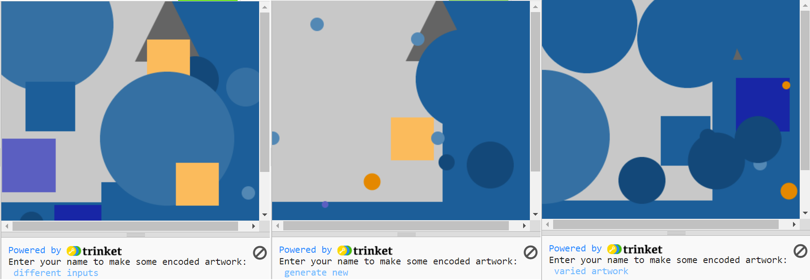
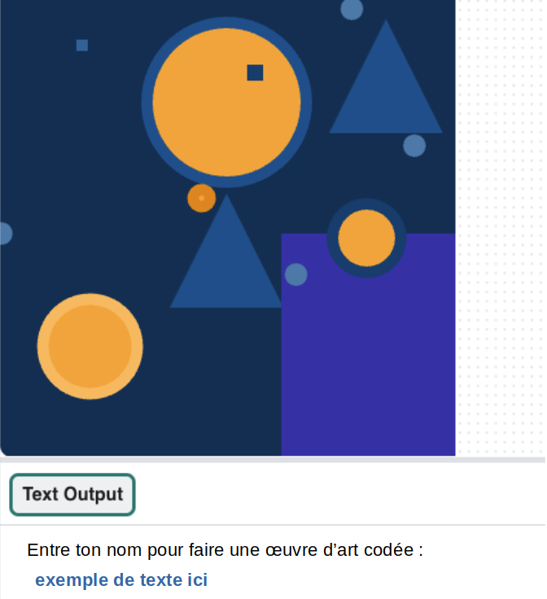

## Coder un message

Utilise le dictionnaire pour coder du texte en plaçant des formes pour chaque caractère du message.

--- task ---

**Supprime** les appels de forme de test dans ta fonction `draw()` en **les commentant** avec un hashtag au début de chaque ligne :

--- code ---
---
language: python
filename: main.py - draw()
line_numbers: false
line_number_start: 
line_highlights: 
---
# forme_1(primaire_2, 100)
# forme_2(primaire_2, 200)
# forme_3(complementaire_2, 100)

--- /code ---

--- /task ---

--- task ---
**Choisis** le texte que tu demanderas à l'utilisateur de fournir à coder. Il pourrait s'agir de leur :
+ Nom
+ Paroles de chansons préférées
+ Citation préférée

--- /task ---

--- task ---

**Crée** un appel `input()` pour que l'utilisateur puisse saisir son message lorsque le programme s'exécute.  
Cela doit être placé avant ton appel `run()` , en dehors de toute définition de fonction.

--- code ---
---
language: python
filename: main.py
line_numbers: false
line_number_start: 
line_highlights: 
---

nom = input()

run()
--- /code ---

Ajoute une instruction `print` avant l'appel `input()` pour inviter l'utilisateur à entrer du texte lorsque le programme s'exécute :

--- code ---
---
language: python
filename: main.py
line_numbers: false
line_number_start: 
line_highlights:
---

print('Tape du texte et appuie sur Entrée pour générer une œuvre codée :')
nom = input()

run()
--- /code ---

--- /task ---

--- task ---

Dans la fonction `draw()` (après ton dictionnaire), appelle la variable globale que tu viens de déclarer et assure-toi que toutes les lettres sont la même casse.

--- code ---
---
language: python
filename: main.py - draw()
line_numbers: false
line_number_start: 
line_highlights: 
---
global nom

nom = nom.lower()

--- /code ---

Si ton dictionnaire est en minuscule, tu dois utiliser `nom.lower()`, mais si tu as entré les lettres en majuscule, tu dois utiliser `nom.upper()`.

--- /task ---

--- task ---

**Crée** une liste pour contenir la série de lettres dans le message prête à être codée, puis remplis la liste en utilisant `append` pour ajouter les valeurs codées du dictionnaire pour chaque lettre. **Append** signifie littéralement **ajouter à la fin** de quelque chose.

--- code ---
---
language: python
filename: main.py - draw()
line_numbers: false
line_number_start: 
line_highlights: 
---

global nom

nom = nom.lower()

message = [] # liste des lettres codées

for lettre in nom: message.append(code[lettre]) # ajouter la lettre codée à la liste
--- /code ---

--- /task ---

--- task ---

**Crée** une boucle for qui imprimera chaque élément de ta liste de `messages` , puis exécute ton code pour voir le résultat.

--- code ---
---
language: python
filename: main.py - draw()
line_numbers: false
line_number_start: 
line_highlights: 
---
for element in message:
    print(element)
--- /code ---

--- /task ---

--- task ---

**Modifie** ta boucle for afin qu'elle vérifie individuellement la liste des valeurs codées en fonction du premier terme de chaque entrée, puis transmette les informations dans tes fonctions de forme pour dessiner une forme pour chaque lettre et place-la sur ton canevas.

--- code ---
---
language: python
filename: main.py - draw()
line_numbers: false
line_number_start: 
line_highlights: 2-7
---
for element in message:
    if element[0] == 'forme 1':
        forme_1(element[1], element[2])
    elif element[0] == 'forme 2':
        forme_2(element[1], element[2])
    elif element[0] == 'forme 3':
        forme_3(element[1], element[2])

--- /code ---

**Facultatif** : si tu as choisi de placer tes formes sur une ligne plutôt que dans des emplacements aléatoires alors ajoute le code pour placer les formes dans une ligne.

--- collapse ---
---
title: Placer des formes sur une ligne
---
Si tu utilises des coordonnées spécifiques pour placer tes formes, tu devras modifier les valeurs globales `startx` et `starty` à l'intérieur de ta boucle `for` et les repasser à tes fonctions à chaque fois.

Tu as besoin que la coordonnée `x` de chaque forme soit modifiée par la `taille` de la dernière forme, pour t'assurer qu'elles s'alignent bien.

Tu devras également vérifier si ta prochaine forme est sur le point d'être dessinée en dehors de ta fenêtre en appelant la fonction `taille_test()` que tu as créée précédemment (qui déplacera la forme suivante vers la « ligne suivante » sur ta fenêtre) :

--- code ---
---
language: python
filename: main.py - draw()
line_numbers: false
line_number_start: 1
line_highlights: 3-4, 7-8, 11-12
---
for element in message:
    if element[0] == 'forme 1':
        forme_1(element[1], element[2]) 
        startx += element[1] 
        taille_test() # Vérifie si tu es sorti hors de la fenêtre
    elif element[0] == 'forme 2':
        forme_2(element[1], element[2])
        startx += element[1]
        taille_test()
    elif element[0] == 'forme 3':
        forme_3(element[1], element[2])
        startx += element[1]
        taille_test()

--- /code ---

--- /collapse ---

--- /task ---

--- task ---

**Teste** ton code pour voir s'il affiche les images que tu as choisies à l'écran. À ce stade, elles devraient toutes apparaître comme prévu.

{:width="400px"}

--- /task ---

--- task ---

**Débogage :**

--- collapse ---
---
title: J'obtiens une erreur concernant le `nom` référencé avant l'attribution
---
Assure-toi d'avoir le `nom` configuré en tant que `variable globale` dans ta fonction de dessin.

--- /collapse ---

--- collapse ---
---
title: Mon œuvre ne ressemble pas à ce à quoi je m'attendais
---
Assure-toi que tes arguments sont appelés dans le bon ordre dans tes appels de fonction et correspondent à l'ordre dans tes définitions de fonction, et que tu utilises les index corrects pour les listes.

`def forme_2(taille, couleur):`

Cette fonction place la taille en premier et la couleur en second.

Lorsque tu appelles `forme_2` tu dois passer des arguments, dans le même ordre que dans la définition.

`forme_2(element[1], element[2])` appelle la fonction forme_2 avec une taille de `element[1]` et une couleur de `element[2]`.

`['forme 1', 20, -11696205]`

Ici, `element[1]` serait `20` et `element[2]` serait `-11696205`.

--- /collapse ---

--- /task ---

--- save ---
