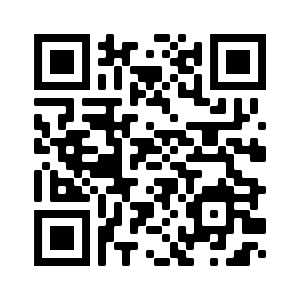

## Wat ga je maken

Maak een gecodeerd kunstwerk op basis van de naam van de gebruiker. Elke letter is gecodeerd in een vorm die willekeurig op het scherm wordt weergegeven.

In dit project ga je:
+ Een dictionary (woordenboek) gebruiken om letters met verschillende vormen te coderen
+ Functies gebruiken met parameters om aanpassingen aan vormen toe te voegen
+ Een uniek stukje digitale kunst maken met gecodeerde letters

Codering is wanneer je gegevens verandert van de ene vorm in een andere. **QR-codes** zijn een klein stukje **gecodeerde** kunst. Ze worden gebruikt om gegevens weer te geven, zoals websiteadressen of tekst. Ze bestaan uit zwart-witte vierkanten die worden gebruikt om letters of cijfers weer te geven. De zwart-witte patronen kunnen door computers worden gelezen en gedecodeerd.

{:width="200px"}

### Doe inspiratie op 💭

Je gaat een ontwerpbeslissing nemen over het soort kunstwerk dat wordt geproduceerd wanneer de gebruiker zijn naam invoert.

--- task ---

Kijk naar deze voorbeelden. Denk na over je achtergrond en bedenk of je ontwerp vormen, patronen, afbeeldingen of een combinatie ervan zal bevatten.

**Cirkels, vierkanten en driehoeken:** [Bekijk van binnen](https://editor.raspberrypi.org/en/projects/circles-squares-triangles){:target="_blank"}

<iframe src="https://editor.raspberrypi.org/en/embed/viewer/circles-squares-triangles" width="600" height="600" frameborder="0" marginwidth="0" marginheight="0" allowfullscreen>
</iframe>

**Verdwaald in de ruimte:** [Zie binnenkant](https://editor.raspberrypi.org/en/projects/lost-in-space){:target="_blank"}

<iframe src="https://editor.raspberrypi.org/en/embed/viewer/lost-in-space" width="600" height="600" frameborder="0" marginwidth="0" marginheight="0" allowfullscreen>
</iframe>

**Al het fruit!:** [Bekijk van binnen](https://editor.raspberrypi.org/en/projects/all-the-fruit){:target="_blank"}

<iframe src="https://editor.raspberrypi.org/en/embed/viewer/all-the-fruit" width="600" height="600" frameborder="0" marginwidth="0" marginheight="0" allowfullscreen>
</iframe>

**Geometrische patronen:** [Bekijk van binnen](https://editor.raspberrypi.org/en/projects/geometric-patterns-example){:target="_blank"}

<iframe src="https://editor.raspberrypi.org/en/embed/viewer/geometric-patterns-example" width="600" height="600" frameborder="0" marginwidth="0" marginheight="0" allowfullscreen>
</iframe>

--- /task ---

