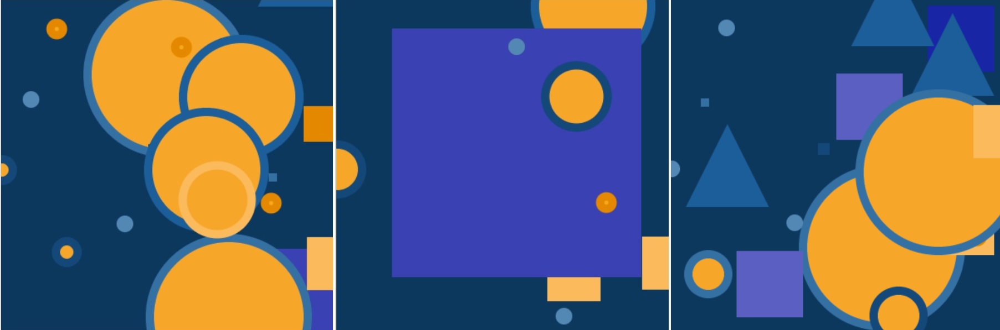

## Een thema kiezen

Heb je ideeën over wat voor soort kunst je wilt maken? In deze stap plan je je kunst en stel je je achtergrond in.

--- task ---

Open het [startproject](https://editor.raspberrypi.org/en/projects/encoded-art-starter){:target="_blank"}. De Raspberry Pi code-editor wordt geopend in een ander tabblad.

--- /task ---

--- task ---

**Kies:** Denk na over het soort kunst dat je wilt maken:
+ Wil je iets kiezen uit jouw erfgoed of populaire cultuur?
+ Zal je kunst bestaande afbeeldingen importeren of geometrische vormen tekenen?
+ Welke kleuren wil je gebruiken?
+ Zal je achtergrond een effen kleur hebben, of bestaan uit meerdere gekleurde vormen?

--- /task ---

Het eerste wat je moet doen bij het maken van kunst met de Python `Processing library` is het toevoegen van `def setup():` om een `setup`-functie te definiëren die eenmaal aan het begin van je programma wordt uitgevoerd.

--- task ---

**Maken:** Definieer de functie `setup()` in je code om de grootte van het uitvoervenster in te stellen. De functie `size()` wordt gebruikt om de grootte van het canvas aan te geven. De argumenten geven de breedte en hoogte in pixels aan.

--- collapse ---
---
title: De schermgrootte instellen wanneer het programma wordt gestart
---

--- code ---
---
language: python filename: main.py - setup() line_numbers: false line_number_start:
line_highlights: 1-2
---
def setup():   
size(400, 400) # 400 by 400 works well for an art canvas

--- /code ---

--- /collapse ---

--- /task ---

--- task ---

**Kies:** experimenteer met de getallen in je `setup()` functie en voer je code uit om een grootte te vinden die je leuk vindt.

--- /task ---

De functie `draw()` voert continu de coderegels uit die zich in het blok bevinden totdat het programma wordt gestopt. Het wordt automatisch direct na `setup()`aangeroepen.

--- task ---

**Maken:** Definieer de functie `draw` in jouw script.

--- /task ---

--- task ---

**Kies:** Denk na over de kleuren die je voor je kunst gaat gebruiken en maak een aantal variabelen die de kleurwaarden bevatten aan het begin van `draw()`.

[[[generic-theory-simple-colours]]]

Je kunt ook zoiets als de [Paletton-kleurenschema-ontwerper](https://paletton.com/){:target="_blank"} gebruiken om je kleurenpalet te kiezen en de RGB-waarden te kopiëren.

--- collapse ---

---
title: Kleur in p5
---

De Color()-functie van p5 verwacht drie getallen: één voor rood, groen en blauw.

--- code ---
---
language: python filename: main.py line_numbers: false line_number_start:
line_highlights: 1
---
blue = Color(50, 70, 206) #Red = 50, Green = 70, Blue = 206

--- /code ---

--- /collapse ---

--- /task ---

Je merkt misschien twee verschillende spellingen op van het Engelse woord **colour** (color) in dit project. De kortere, color, heeft de voorkeursspelling in de Verenigde Staten. Andere landen kunnen de langere vorm gebruiken, colour. Elke vooraf gedefinieerde code, zoals `Color()`, gebruikt doorgaans de Amerikaanse spelling.

--- task ---

**Maak** een functie die **een achtergrond** tekent met behulp van je kleurenpalet. Voeg vervolgens een aanroep toe aan je `draw()` functie.

--- collapse ---
---
title: De achtergrondkleur instellen wanneer het programma wordt gestart
---

Boven je `draw()` functie, definieer een nieuwe functie genaamd `teken_achtergrond()` en maak een aanroep in `draw():`, na een aanroep aan `no_stroke()`.

--- code ---
---
language: python filename: main.py - draw_background() line_numbers: false line_number_start:
line_highlights: 1-4
---
def draw_background(colour): # Background colour fill(colour) rect(0, 0, 400, 400)

--- /code ---

Maak er vervolgens een aanroep naar in `draw()`:

--- code ---
---
language: python filename: main.py - draw() line_numbers: false line_number_start:
line_highlights: 8
---
def draw():

    red = Color(255,0,0)
    green = Color(0,255,0)
    blue = Color(0,0,255)
    
    no_stroke()
    draw_background(red)

--- /code ---

Als je wilt dat je achtergrond meerdere kleuren heeft, moet je meer parameters toevoegen.

--- code ---
---
language: python filename: main.py - draw_background() line_numbers: false line_number_start:
line_highlights: 1, 6-7
---
def draw_background(green, blue):

    # Background colour
    fill(blue)
    rect(0, 0, 400, 200)
    fill(green)
    rect(0, 200, 400, 200)

--- /code ---

Voeg vervolgens de nieuwe kleur toe aan je `teken_achtergrond()` aanroep in `draw()`:

--- code ---
---
language: python filename: main.py - draw() line_numbers: false line_number_start:
line_highlights: 8
---
def draw():

    red = Color(255, 0, 0)
    green = Color(0, 255, 0)
    blue = Color(0, 0, 255)
    
    no_stroke()
    draw_background(green, blue)

--- /code ---

--- /collapse ---

--- /task ---

--- task ---

**Maak** een aanroep naar `run()` helemaal aan het einde van je script (zonder inspringing!) om het programma uit te voeren:

--- code ---
---
language: python filename: main.py line_numbers: false line_number_start: 1
line_highlights: 1
---
run()

--- /code ---

--- /task ---

--- task ---

**Test:** Voer je project uit om de gekozen schermgrootte en achtergrondkleur te zien.

--- /task ---

--- task ---

**Debug:** Mogelijk vind je enkele fouten in jouw project die je moet oplossen. Hier zijn enkele veelvoorkomende fouten.

--- collapse ---
---
title: Ik heb mijn grootte en kleur bijgewerkt, maar het uitvoergebied blijft hetzelfde
---

Nadat je de code hebt gewijzigd, moet je je project `uitvoeren` om de wijzigingen in het uitvoergebied te zien.

Zorg ervoor dat je een aanroep doet naar `run()` helemaal aan het einde van je script buiten een van je functiedefinities (niet ingesprongen).

--- /collapse ---

--- collapse ---
---
title: Ik heb verschillende getallen geprobeerd, maar de achtergrondkleur verandert niet
---

De maximale hoeveelheid rood, groen of blauw is `255`. Zorg ervoor dat alle `achtergrond` kleurwaarden tussen `0` en `255` liggen.

--- /collapse ---

--- /task ---

--- save ---
