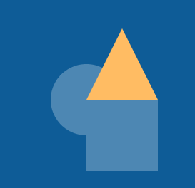

## Teken je vormen

Definieer je vorm-functies in zodat je ze in je gecodeerde bestanden kunt gebruiken. 

{:width="300px"}

--- task ---

Bepaal hoeveel unieke **vormen** je in je kunstwerk wilt hebben. De voorbeeldprojecten hebben **drie** unieke vormen. Deze worden vervolgens gewijzigd met behulp van de parameters van de functie. Misschien wil je er meer dan drie hebben, de beslissing is aan jou!

Hier zijn enkele ideeën:
+ Drie vormfuncties die afbeeldingen van vlinders, slakken of vogels laden
+ Drie vormfuncties die vierkanten, cirkels en driehoeken tekenen
+ Vijf vormfuncties, elk tekent een uniek dier

--- /task ---

--- task ---

**Definieer** elke vorm-functie ter voorbereiding op het toevoegen van de code die nodig is om elke vorm te tekenen. Zorg ervoor dat je de vorm-functies **hierboven** definieert van je `draw()` functie.

--- collapse ---
---
title: Definieer je functies
---
Je kunt de functies op de volgende manier definiëren:

--- code ---
---
language: python
filename: main.py
line_numbers: false
line_number_start: 
line_highlights: 
---
def vorm_1():
   
def vorm_2():

def vorm_3():

--- /code ---

--- /collapse ---

--- /task ---

--- task ---

Bepaal welke **parameters** je functies nodig hebben. Hier zijn enkele ideeën:
+ Een `kleur` parameter waarmee je de kleur van de vormen die je hebt gemaakt kunt wijzigen
+ Een `grootte` parameter om de grootte van de vorm of afbeelding aan te passen.
+ Een `omtrek` parameter die een andere kleur toevoegt aan de rand van een tekening

--- /task ---

--- task ---

**Voeg** de door jou gekozen **parameters** toe binnen de ronde haakjes van elk van je **vorm** functies.

--- collapse ---
---
title: Voeg parameters toe aan je functies
---
Je kunt parameters aan je functies toevoegen op de volgende manier:

--- code ---
---
language: python
filename: main.py
line_numbers: false
line_number_start: 
line_highlights: 
---
def vorm_1(grootte, kleur):
   
def vorm_2(grootte, omtrek):

def vorm_3(object, kleur):

--- /code ---

--- /collapse ---

--- /task ---

--- task ---

**Voeg** de code toe in elke vorm-functie, zodat de tekening of afbeelding verschijnt wanneer de functie wordt **aangeroepen**.

Kies: Hoe ziet jouw vorm eruit? Je vorm kan zijn:
  - Een afbeelding in het startproject
  - Een emoji 🎈 of tekst
  - Getekend met behulp van een reeks geometrische vormen

In het project [Een gezicht maken](https://projects.raspberrypi.org/nl-NL/projects/make-a-face/0){:target="_blank"} heb je geleerd hoe je een groep geometrische vormen kunt gebruiken om leuke gezichten te creëren. Je kunt je vaardigheden uit dat project gebruiken om je te helpen je afbeeldingen te tekenen.

### Vormen

[[[processing-python-ellipse]]]

[[[processing-python-rect]]]

[[[processing-python-triangle]]]

[[[processing-python-quad]]]

[[[processing-translation]]]

[[[processing-rotation]]]

### Kleuren en effecten

[[[generic-theory-simple-colours]]]

[[[processing-opacity]]]

[[[processing-stroke]]]

[[[processing-tint]]]

### Voorbeelden

Hier is wat voorbeeldcode voor het tekenen van een vierkant in je gecodeerde kunstproject:

--- code ---
---
language: python
filename: main.py - shape_2()
line_numbers: false
line_number_start: 
line_highlights: 
---
def vorm_2(kleur, grootte):

    fill(kleur)   
    rect(200, 200, grootte, grootte)

--- /code ---

**Merk op** dat de parameters die zijn gedefinieerd in de functie hierboven daarna worden gebruikt om de vorm te tekenen.

--- collapse ---
---
title: Laad een afbeelding
---

Het voorbeeldproject [Verdwaald in de ruimte](https://editor.raspberrypi.org/nl-NL/projects/lost-in-space){:target="_blank"} laadt afbeeldingen om gecodeerde bestanden te maken.

**Onthoud** dat je code nodig hebt om de afbeelding weer te geven:

--- code ---
---
language: python
filename: main.py - shape_1()
line_numbers: false
---
def vorm_1(grootte, kleur): 
  
    if kleur == 'paars':
        image(paarse_planeet, 400, 400, grootte, grootte) 
    elif kleur == 'oranje':
        image(oranje_planeet, 400, 400, grootte, grootte)
    elif kleur == 'groen':
        image(groene_planeet, 400, 400, grootte, grootte)
    elif kleur == 'grijs':
        image(grijze_maan, 400, 400, grootte, grootte)

--- /code ---

Je hebt ook code nodig om de afbeelding te **laden** in de `setup()` functie:

--- code ---
---
language: python
filename: main.py - setup()
line_numbers: false
---
def setup():

    # Geef andere functies toegang tot de afbeeldingen
    global paarse_planeet
    
    frame_rate(10)
    size(400, 400)
    
    # Laad de benodigde afbeeldingen in variabelen
    paarse_planeet = load_image('purple_planet.png')
    oranje_planeet = load_image('orange_planet.png')
    groene_planeet = load_image('green_planet.png')
    grijze_maan = load_image('moon.png')

--- /code ---

--- /collapse ---

--- collapse ---

---
title: Emoji-tekens gebruiken
---

Je kunt emoji-tekens gebruiken in de p5-functie text() om een emoji als speler te gebruiken.

Hier is een voorbeeld:

--- code ---
---
language: python
filename: main.py
line_numbers: 
line_number_start: 
line_highlights: 
---
def setup():
    size(400, 400)
    text_align(CENTER, TOP) # Positie rond het midden

def teken_emoji(emoji, grootte): # slang
    text_size(grootte) # Bepaalt de grootte van de emoji
    text(emoji, 200, 200)
  
--- /code ---
--- /collapse ---

--- /task ---

--- task ---

Om **te testen** of je vorm-functies correct werken, moet je ze **aanroepen** vanuit de `draw()` functie. Houd er rekening mee dat je `#` kunt gebruiken om coderegels van commentaar te voorzien, zodat je slechts één vorm tegelijk ziet.

Zorg ervoor dat je de argumenten voor je gekozen parameters toevoegt!

In het onderstaande voorbeeld zijn twee of drie argumenten nodig.

--- code ---
---
language: python
filename: main.py
line_numbers: false
line_number_start: 
line_highlights: 
---
    vorm_1(100, kleur_1)
    vorm_2(100, kleur_2)
    teken_emoji('🐍', 100)

--- /code ---

**Merk op** dat de namen van de variabelen voor de gekozen `kleur` in de eerste parameter zijn geplaatst en dat er enkele waarden zijn toegevoegd voor de gekozen `grootte` in de tweede parameter.

--- /task ---

Prototyping houdt in dat je een concept maakt van wat je denkt dat je uiteindelijke project zou kunnen bereiken. Het doel van prototypen is om snel een vereenvoudigde versie van het eindproduct te maken, zodat je kunt testen of het een werkbare oplossing voor het probleem is.

--- task ---

**Test** je code om te zien of de door jou gekozen afbeeldingen op het scherm worden weergegeven. Op dit moment kunnen ze misschien allemaal boven aan elkaar komen te staan. Je zou elke functie afzonderlijk kunnen **aanroepen** om ze duidelijker te zien.

--- /task ---

--- task ---

**Fouten oplossen:**

--- collapse ---
---
title: Je ziet een fout over argumenten
---
+ Toen je je functie **definieerde**, besloot je hoeveel **parameters** deze nodig had. Je moet ervoor zorgen dat wanneer je de functie aanroept, deze hetzelfde aantal **argumenten** heeft.

--- /collapse ---

--- collapse ---
---
title: Slechts één vorm wordt weergegeven
---
+ Controleer of je elke vorm-functie **aangeroepen** hebt.
+ De vormen zijn er wel, maar misschien staan ze bovenop elkaar. Om dit te veranderen kun je één functie tegelijk aanroepen door op de andere twee functieaanroepen even in comments te veranderen met een hashtag `#`.

--- /collapse ---

--- collapse ---
---
title: De tekeningen zijn niet de juiste vorm/grootte
---
+ Controleer of je de **argumenten** in de functie in dezelfde volgorde hebt ingevoerd als de **parameters** in de functie.

--- /collapse ---

--- /task ---

--- save ---
