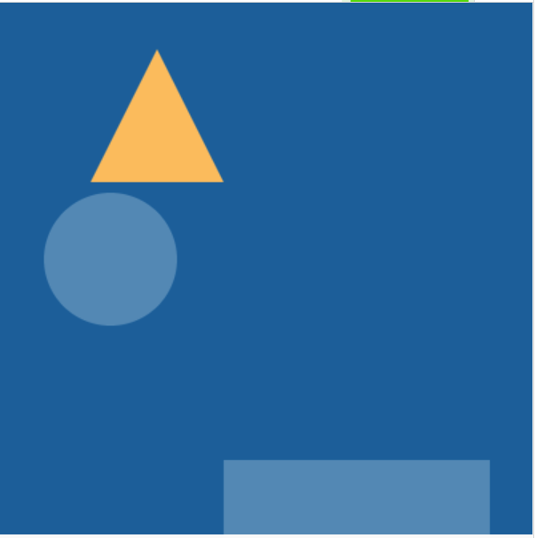

## Plaats je vormen

Nu je herbruikbare vormen voor je illustraties hebt, moet je ze op het canvas plaatsen.

{:width="300px"}

--- task ---

**Kies:** Hoe zet je de vormen op het canvas? Zullen ze willekeurig zijn of een specifiek patroon hebben?

--- /task ---

--- task ---

**Beslis** waar je jouw vormen in het venster wilt laten verschijnen. Ze zouden kunnen verschijnen:

+ Willekeurig in het venster
+ In volgorde van links naar rechts
+ Elke keer op dezelfde plaats
+ Naar een ander vast patroon

[[[using-seed-in-python]]]

--- collapse ---
---
title: Vormen willekeurig positioneren
---

Van de `random` bibliotheek, importeer `randint` en `seed` bovenaan je script.

--- code ---
---
language: python
filename: main.py
line_numbers: false
---
from random import randint, seed

--- /code ---

**Voeg** een aanroep toe aan `seed()` in je `draw()` functie onder `teken_achtergrond()`. Je moet een argument voor de seed invoeren, wat een willekeurig getal kan zijn:

--- code ---
---
language: python
filename: main.py - draw()
line_numbers: false
line_number_start: 
line_highlights: 
---
    teken_achtergrond(rood)
    seed(32)

--- /code ---

Verander je vorm functies om willekeurige coördinaten in te stellen voor elke vorm tijdens het tekenen:

--- code ---
---
language: python
filename: main.py - shape_1()
line_numbers: false
line_number_start: 1 
line_highlights: 
---
def vorm_1(kleur, grootte):
  
    fill(kleur)   
    ellipse(200, 200, grootte, grootte)
--- /code ---

Wordt:

--- code ---
---
language: python
filename: main.py - shape_1()
line_numbers: false
line_number_start: 1
line_highlights: 3-4
---
def vorm_1(kleur, grootte):
  
    x = randint(0, 400)
    y = randint(0, 400)
    fill(kleur)   
    ellipse(x, y, grootte, grootte)
--- /code ---

--- /collapse ---

--- collapse ---
---
title: Gebruik coördinaten om vormen in groepen te plaatsen
---
Sommige vormen in de `p5` bibliotheek vereisen dat al hun hoeken worden gedeclareerd, specifiek `driehoeken` en `vierhoeken`. Om hun posities willekeurig te maken, moet je wat snelle wiskunde doen.

Bijvoorbeeld:

--- code ---
---
language: python
filename: main.py
line_numbers: false
line_number_start: 
line_highlights: 
---
def vorm_1(kleur)
    fill(kleur)
    triangle(200, 200, 250, 100, 300, 200)

--- /code ---

Wordt:

--- code ---
---
language: python
filename: main.py
line_numbers: false
line_number_start: 
line_highlights: 
---
def vorm_1(kleur, x, y):
    fill(kleur)
    x = randint(0, 400)
    y = randint(0, 400)
    triangle(x - 5, y - 35, x + 5, y - 75, x + 20, y - 75)
--- /code ---

--- /collapse ---

--- collapse ---
---
title: Maak een specifiek plaatsingspatroon
---

Als je kijkt naar **Geometrische patronen** zul je merken dat de vormen van links naar rechts over de pagina worden geplaatst en vervolgens naar beneden, zoals tekst:

[Bekijk van binnen](https://editor.raspberrypi.org/nl-NL/projects/geometric-patterns-example){:target="_blank"}

<iframe src="https://editor.raspberrypi.org/nl-NL/embed/viewer/geometric-patterns-example" width="600" height="600" frameborder="0" marginwidth="0" marginheight="0" allowfullscreen>
</iframe>

Dit kan worden bereikt door global variabelen te maken in je tekenlus genaamd `startx` en `starty`, vervolgens beide instellen op `0`:

--- code ---
---
language: python
filename: main.py - draw()
line_numbers: false
line_number_start: 
line_highlights: 
---
global startx, starty
startx = 0
starty = 0

--- /code ---

Deze variabelen worden gebruikt om de `x` en `y` waarden voor elke vorm in de hoofdmenu functie die je later schrijft. Binnen elk van je vorm functies verander je de waarden `x` en `y` om deze global variabelen te gebruiken.

--- code ---
---
language: python
filename: main.py - shape_2()
line_numbers: false
line_number_start: 
line_highlights: 
---
def vorm_2(kleur, grootte):

    x = randint(0, 400)
    y = randint(0, 400)
    fill(kleur)   
    rect(x, y, grootte, grootte)
--- /code ---

Wordt:

--- code ---
---
language: python
filename: main.py - shape_2()
line_numbers: false
line_number_start: 
line_highlights: 
---
def vorm_2(kleur, grootte): 

    global startx
    global starty
    x = startx
    y = starty
    fill(kleur)   
    rect(x, y, grootte, grootte)
--- /code ---

Omdat je moet detecteren of de vormen 'van de zijkant' van het doek zullen gaan, maak je een functie om het initiële `x` coördinaat van de volgende vorm te controleren of het kleiner is dan de grootte van je venster en zet het terug naar 0 als het niet waar is, terwijl je het ook naar beneden beweegt door het initiële `y` coördinaat van de vorm te verhogen.

**Definieer** nu een nieuwe functie genaamd `grootte_controle()`:

--- code ---
---
language: python
filename: main.py - size_check()
line_numbers: false
line_number_start: 
line_highlights: 
---
def grootte_controle():

    global startx
    global starty
    if startx >= 400:
        startx = 0
        starty +=80

--- /code ---

**Tip:** Kijk voor meer instructies over het aanroepen van deze functie bij het coderen van de invoerlus tijdens de **Een bericht coderen** stap!

--- /collapse ---

--- /task ---

--- task ---

**Test** je code om te zien of de door jou gekozen afbeeldingen juist op het scherm worden weergegeven.

Als je een willekeurig patroon hebt gebruikt, experimenteer dan met de `seed()` waarde om het patroon te veranderen!

--- /task ---

--- task ---

**Fouten oplossen:**

--- collapse ---
---
title: Ik krijg een fout over `randint` of `seed`
---
Zorg ervoor dat je `randint` en `seed` van de `random` bibliotheek bovenaan je script hebt geïmporteerd: `from random import randint, seed`.

--- /collapse ---

--- collapse ---
---
title: Het patroon is niet anders dan de vorige keer
---
Zorg ervoor dat de vorm-functies regels `x = randint(0,400)` en `y = randint(0,400)` bevatten en de vorm parameters zijn ingesteld op `x` en `y`, niet op getallen: `rect(x, y, grootte, grootte)`

--- /collapse ---

--- collapse ---
---
title: Mijn vormen bewegen heel snel
---
Zorg ervoor dat je een aanroep aan `seed()` in je `draw()` functie hebt opgenomen, welke een getal als argument bevat: `seed(72)`

--- /collapse ---

--- /task ---

--- save ---
