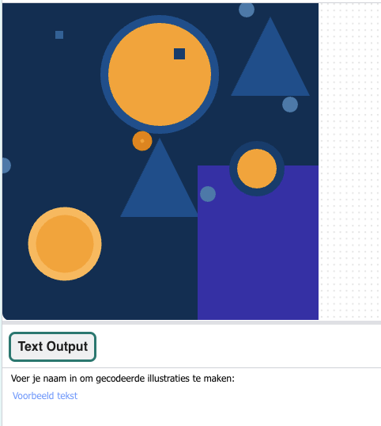

## Codeer een bericht

Gebruik de dictionary om tekst te coderen door vormen voor elk teken in het bericht te plaatsen.

--- task ---

**Verwijder** de testvormaanroepen in je `draw()` functie door **ze te te veranderen in commentaar** met een hashtag aan het begin van elke regel:

--- code ---
---
language: python filename: main.py - draw() line_numbers: false line_number_start:
line_highlights:
---
# shape_1(primary_2, 100)
# shape_2(primary_2, 200)
# shape_3(complementary_2, 100)

--- /code ---

--- /task ---

--- task --- **Kies** welke tekst je de gebruiker zal vragen om te laten coderen. Het zou kunnen zijn:
+ Hun naam
+ Hun favoriete songtekst
+ Hun favoriete quote

--- /task ---

--- task ---

**Maak** een `input()</1 >-aanroep zodat de gebruiker zijn of haar bericht kan typen wanneer het programma wordt uitgevoerd.<2/>
Dit moet vóór je <code>run()` aanroep gebeuren, buiten eventuele functiedefinities.

--- code ---
---
language: python filename: main.py line_numbers: false line_number_start:
line_highlights:
---

name = input()

run() --- /code ---

Voeg een `print`-instructie toe vóór de `input()`-aanroep, om de gebruiker te vragen wat tekst in te voeren wanneer het programma wordt uitgevoerd:

--- code ---
---
language: python filename: main.py line_numbers: false line_number_start:
line_highlights:
---

print('Type some text and press Enter to generate an encoded artwork:') name = input()

run() --- /code ---

--- /task ---

--- task ---

In de functie `draw()` (na je dictionary), roep je de global variabele aan die je zojuist hebt gedeclareerd en zorg je ervoor dat alle letters op dezelfde manier zijn weergegeven (allemaal kleine of grote letters).

--- code ---
---
language: python filename: main.py - draw() line_numbers: false line_number_start:
line_highlights:
---
global name

name = name.lower()

--- /code ---

Als je dictionary in kleine letters is, moet je `naam.lower()` gebruiken, maar als je de letters in hoofdletters hebt ingevoerd, moet je `naam.upper()` gebruiken.

--- /task ---

--- task ---

**Maak** een lijst om de reeks letters in het bericht klaar te houden om te coderen, vul vervolgens de lijst in met behulp van `append` om de gecodeerde dictionary waarden toe te voegen voor elke letter. **Append** betekent letterlijk **toevoegen aan het einde** van iets.

--- code ---
---
language: python filename: main.py - draw() line_numbers: false line_number_start:
line_highlights:
---

global name

name = name.lower()

message = [] # list for the encoded letters

for letter in name: message.append(code[letter]) # add the encoded letter to the list --- /code ---

--- /task ---

--- task ---

**Maak** een for-lus die elk item in je `berichten` lijst afdrukt en voer vervolgens je code uit om de uitvoer te zien.

--- code ---
---
language: python filename: main.py - draw() line_numbers: false line_number_start:
line_highlights:
---
for item in message: print(item) --- /code ---

--- /task ---

--- task ---

**Bewerk** je for-lus zodat deze individueel de lijst met gecodeerde waarden controleert op basis van de eerste term in elke invoer, en vervolgens de informatie doorgeeft aan je vormfuncties om voor elke letter een vorm te tekenen en deze op je canvas te plaatsen.

--- code ---
---
language: python filename: main.py - draw() line_numbers: false line_number_start:
line_highlights: 2-7
---
for item in message: if item[0] == 'shape 1': shape_1(item[1], item[2]) elif item[0] == 'shape 2': shape_2(item[1], item[2]) elif item[0] == 'shape 3': shape_3(item[1], item[2])

--- /code ---

**Optioneel**: Als je ervoor hebt gekozen om je vormen op een lijn te plaatsen in plaats van op willekeurige locaties, voeg dan de code toe voor het plaatsen van vormen op een lijn.

--- collapse ---
---
title: Plaats vormen in een lijn
---
Als je specifieke coördinaten gebruikt om je vormen te plaatsen, moet je de global `startx` en `starty` waarden binnen je `for` lus veranderen en elke keer weer aan je functies doorgeven.

Je hebt de `x` coördinaat van elke vorm nodig om te veranderen met de `grootte` van de laatste vorm, om er zeker van te zijn dat ze mooi op één lijn liggen.

Je moet ook controleren of je volgende vorm niet wordt getekend buiten je venster door de `grootte_controle()` functie aan te roepen die je eerder hebt gemaakt (deze zal de volgende vorm naar de 'volgende lijn' in je venster verplaatsen):

--- code ---
---
language: python filename: main.py - draw() line_numbers: false line_number_start: 1
line_highlights: 3-4, 7-8, 11-12
---
for item in message: if item[0] == 'shape 1': shape_1(item[1], item[2]) startx += item[1] size_check() # Check to see if you've gone off the side of the window elif item[0] == 'shape 2': shape_2(item[1], item[2]) startx += item[1] size_check() elif item[0] == 'shape 3': shape_3(item[1], item[2]) startx += item[1] size_check()

--- /code ---

--- /collapse ---

--- /task ---

--- task ---

**Test** je code om te zien of de door jou gekozen afbeeldingen op het scherm worden weergegeven. Nu moeten ze allemaal verschijnen zoals jij het verwacht.

{:width="400px"}

--- /task ---

--- task ---

**Fouten oplossen:**

--- collapse ---
---
title: Ik krijg een foutmelding over `naam` waarnaar wordt verwezen vóór de toewijzing
---
Zorg ervoor dat je `naam` hebt ingesteld als een `global` variabele in je tekenfunctie.

--- /collapse ---

--- collapse ---
---
title: Mijn kunst ziet er niet uit zoals ik had verwacht
---
Zorg ervoor dat je argumenten in de juiste volgorde worden aangeroepen in je functieaanroepen en dat de volgorde overeenkomt met je functiedefinities, en je de juiste indexen voor de lijsten hebt gebruikt.

`def shape_2(size, color):`

Deze functie plaatst de grootte op de eerste plaats en de kleur op de tweede plaats.

Wanneer je `vorm_2` aanroept, moet je argumenten doorgeven, in dezelfde volgorde als in de definitie.

`vorm_2(item[1], item[2])` roept de vorm_2 functie aan met een grootte van `item[1]` en een kleur `item[2]`.

`['shape 1', 20, -11696205]`

Hier, zou `item[1]` `20` zijn en `item[2]` `-11696205`.

--- /collapse ---

--- /task ---

--- save ---
